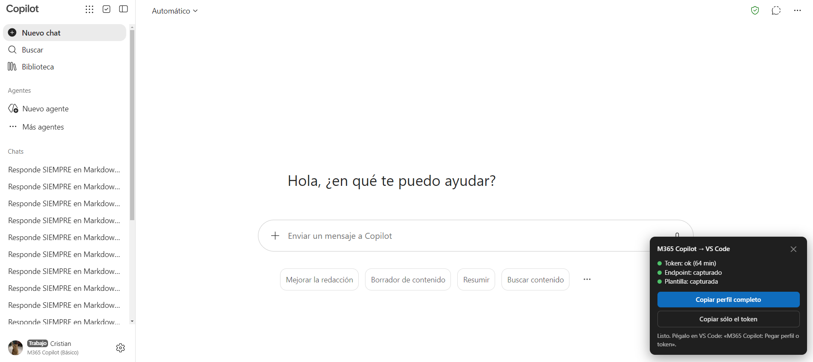
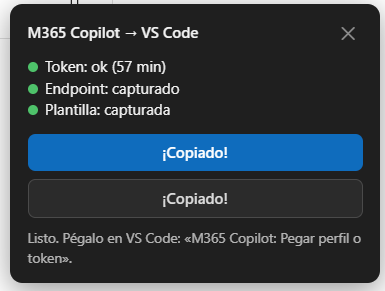

# Installation and usage guide — M365 Copilot for VS Code

**English** · [Español](Guia.md)

There are two ways to get your Microsoft 365 Copilot token into VS Code:

- **Option A — browser extension (recommended).** It captures the token, renews
  it before it expires and sends it to VS Code without any copy and paste.
- **Option B — Tampermonkey userscript.** It shows a panel on the M365 Copilot
  website from which you copy the token and paste it into VS Code by hand (and
  again when it expires, roughly every hour).

> VS Code also has the M365 Copilot **Get started** walkthrough (*Help →
> Welcome*, or from the menu behind the **M365** status bar item) with these
> same steps.
>
> The screenshots were taken with a Spanish user interface; the elements are
> the same in English.

## 1. Option A: browser extension

1. Download the extension for your browser from the
   [repository releases](https://github.com/cristiancastineiras/M365CopilotVSCode/releases)
   (Chrome/Edge or Firefox), unzip it and load it (in Chrome/Edge:
   `chrome://extensions` → *Developer mode* → *Load unpacked*; in Firefox:
   `about:debugging` → *This Firefox* → *Load Temporary Add-on*).
2. Go to [Microsoft 365 Copilot](https://m365.cloud.microsoft/chat/) and send
   any message.
3. Open the extension's popup: when everything is green, the token is already
   in VS Code. As long as some M365 tab stays open, it renews itself.

If you use this option, skip to [step 4](#4-install-the-vs-code-extension).

## 2. Option B: install Tampermonkey and the userscript

First install Tampermonkey, a userscript manager, for your browser. It has been
tested on Chrome and Edge.

- [Google Chrome](https://chromewebstore.google.com/detail/tampermonkey/dhdgffkkebhmkfjojejmpbldmpobfkfo)
- [Mozilla Firefox](https://addons.mozilla.org/en-US/firefox/addon/tampermonkey/)
- [Microsoft Edge](https://microsoftedge.microsoft.com/addons/detail/tampermonkey/iikmkjmpaadaobahmlepeloendndfphd)

Then add the userscript that captures the Microsoft 365 Copilot access token,
endpoint and invocation template:

1. Pin the extension in the browser's extension bar and click it.

2. Click **Create a new script** and paste the contents of [`ms365copilot-token.user.js`](ms365copilot-token.user.js).

3. Click **File > Save**. You can also drag the file onto the editor.

Once installed or saved, it shows up among the installed scripts:

The userscript's panel is in English or Spanish depending on your browser's
language.

## 3. Option B: capture the token

With the script installed and enabled, go to [Microsoft 365 Copilot](https://m365.cloud.microsoft/chat/).

A box like this one should appear in the bottom-right corner of the page:

To make sure everything was captured, you can send a "hello" in the chat. If
the three dots turn green, it is ready.

You can copy the full profile or just the token: the extension only uses the
access token, so either works. **Copy token only** is the simplest.

## 4. Install the VS Code extension

Open VS Code and install the M365 Copilot extension.

Once installed, the **M365** item appears in the status bar (bottom right). Its
icon tells you the token state (🔑 none yet, ⚠ expired) and clicking it opens
the menu with every action.

If you use the userscript, paste the token: open the command palette with
`Ctrl + Shift + P`, search for `M365` and run **M365 Copilot: Paste profile or
token** (or choose *Paste profile or token* in the status bar menu).

## 5. Show the models in the chat

The most direct way is to type **`@m365`** in the chat: M365 Copilot always
answers, without touching the model picker.

If you prefer to use it as a model (for example in agent mode), you have to show
it in the picker, because it does not appear at first:

In the model picker, click the gear and then **Other models**:

Scroll down to see the M365 Copilot options:

You can pin them; otherwise they appear at the end of the model picker.

## 6. Start using it

You can ask a coding question:

Or ask for a code edit: the changes appear highlighted in the editor with
**Keep / Undo** above them (and in the editor title bar) so you can accept or
revert them.

From the editor itself:

- **Right-click → M365 Copilot**: explain, ask about, fix, document or generate
  tests for the selected code (or the function the cursor is in).
- **Lightbulb (`Ctrl + .`)** on an error: **Fix with M365 Copilot**.
- **Source Control**: the ✨ button in the title bar writes the commit message
  with M365 Copilot.

## 7. Language

By default the extension follows VS Code's language (English or Spanish). To
change it: status bar menu → **Language**, or the `ms365copilot.language`
setting. It also changes the language of the instructions sent to the model, so
it answers in that language.

---

It works well for exploring files and folders, answering questions and editing
code — quite good for a wrapper around a model that was not built to work as an
agent or an MCP client.
