# Installation and usage guide — M365 Copilot for VS Code

**English** · [Español](Guia.md)

There are two ways to get your Microsoft 365 Copilot token into VS Code:

- **Option A — browser extension (recommended).** It captures the token, renews
  it before it expires and sends it to VS Code without any copy and paste.
- **Option B — Tampermonkey userscript.** It does the same capture as the
  browser extension (they share the code) and also sends the token to VS Code by
  itself; it also shows a small panel with the connection state and buttons to
  copy the token by hand.

> VS Code also has the M365 Copilot **Get started** walkthrough (*Help →
> Welcome*, or from the menu behind the **M365** status bar item) with these
> same steps.
>
> The screenshots were taken with a Spanish user interface; the elements are
> the same in English.

## 1. Option A: browser extension

1. Download the extension for your browser from the
   [repository releases](https://github.com/cristiancastineiras/M365CopilotVSCode/releases)
   (Chrome/Edge or Firefox) and load it (in Chrome/Edge: unzip it, then
   `chrome://extensions` → *Developer mode* → *Load unpacked*; in Firefox: open
   the signed `.xpi`, or without it `about:debugging` → *This Firefox* → *Load
   Temporary Add-on* with the `.zip` — see the
   [browser extension README](https://github.com/cristiancastineiras/M365CopilotVSCode/blob/main/extensiones/browser/README.md#install)).
2. Go to [Microsoft 365 Copilot](https://m365.cloud.microsoft/chat/) and send
   any message.
3. Open the extension's popup: when everything is green, the token is already
   in VS Code. As long as some M365 tab stays open, it renews itself.

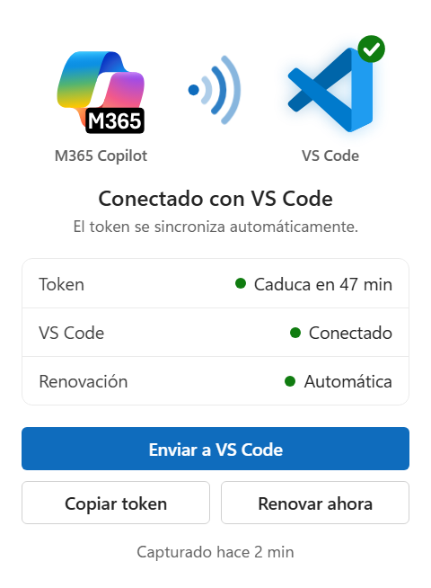

If you use this option, skip to [step 4](#4-install-the-vs-code-extension).

## 2. Option B: install Tampermonkey and the userscript

First install Tampermonkey, a userscript manager, for your browser. It has been
tested on Chrome and Edge.

- [Google Chrome](https://chromewebstore.google.com/detail/tampermonkey/dhdgffkkebhmkfjojejmpbldmpobfkfo)
- [Mozilla Firefox](https://addons.mozilla.org/en-US/firefox/addon/tampermonkey/)
- [Microsoft Edge](https://microsoftedge.microsoft.com/addons/detail/tampermonkey/iikmkjmpaadaobahmlepeloendndfphd)

Then add the userscript. The simplest way is to open
[this link](https://raw.githubusercontent.com/cristiancastineiras/M365CopilotVSCode/main/extensiones/vscode/m365copilot-token.user.js) with Tampermonkey installed: it offers **Install**, and from
then on the script updates itself when a new version is released.

You can also install it by hand:

1. Pin the extension in the browser's extension bar and click it.

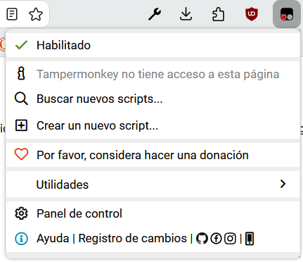

2. Click **Create a new script** and paste the contents of [`m365copilot-token.user.js`](m365copilot-token.user.js).

3. Click **File > Save**. You can also drag the file onto the editor.

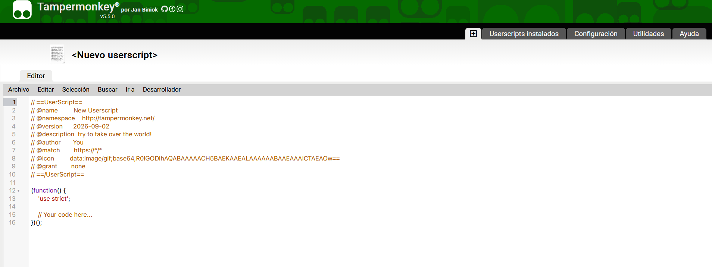

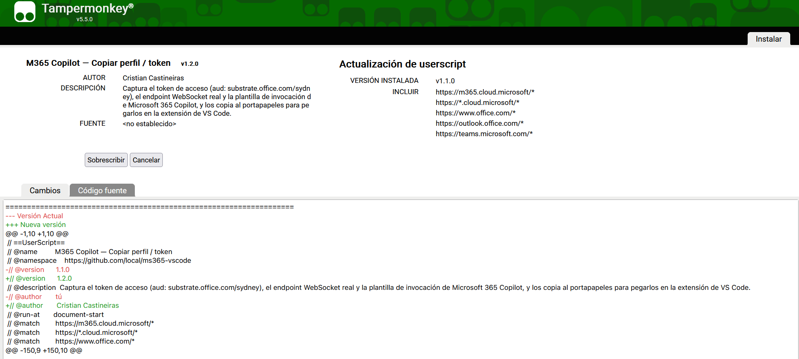

Once installed or saved, it shows up among the installed scripts:

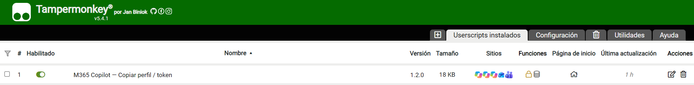

The userscript's panel is in English or Spanish depending on your browser's
language.

> If you had an older version of the userscript installed, replace it with the
> new one (or install it from the link above): the old one stopped picking up
> the token as soon as it had one, and could only copy it by hand.

## 3. Option B: capture the token

With the script installed and enabled, go to [Microsoft 365 Copilot](https://m365.cloud.microsoft/chat/).

The userscript's panel appears in the bottom-right corner. Send a "hello" in
the chat so it captures the token.

**The first time, Tampermonkey asks you to let the script connect to
`localhost`.** Click **Always allow**: that is the VS Code extension's local
server, and it is what lets the token reach VS Code without copy and paste.

The panel's illustration tells you where you are:

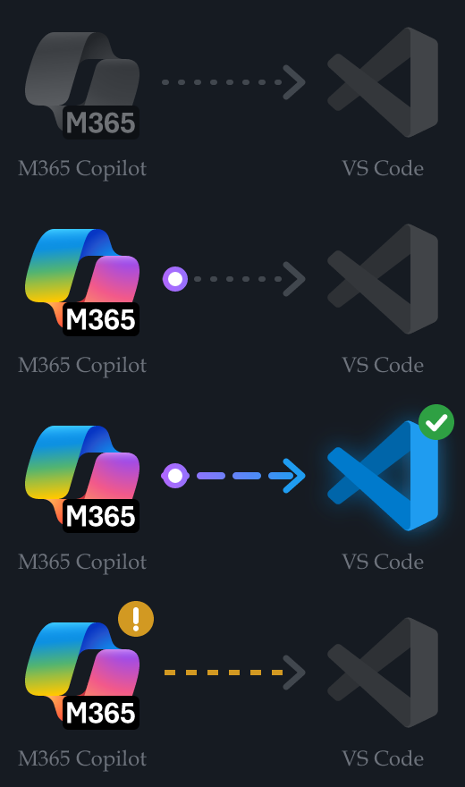

1. **Waiting for the token**: both logos grey and the grey signal spinning; the M365 logo "breathes".
2. **Token ready**: the M365 logo lights up and the signal spins in blue looking for VS Code, which stays grey because it is not answering yet (open it with the extension enabled).
3. **Connected to VS Code**: the signal stops and points at VS Code, which lights up. Done — it is sent again by itself every time it is renewed.
4. **Token expired**: a weak amber signal. Reload the page (the panel's button does it) or sign in again.

The panel can be minimized (–) to a small icon, and the Tampermonkey menu has
**Send token to VS Code now**, **Show panel** and the option to renew a hidden
tab whose token expired by itself (by reloading it).

If you do not grant the `localhost` permission, the panel still has **Copy
token** and **Copy profile**: paste either into VS Code with **M365 Copilot:
Paste profile or token**.

## 4. Install the VS Code extension

Open VS Code and install the M365 Copilot extension.

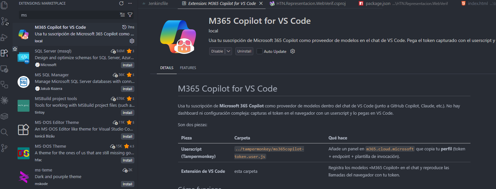

Once installed, the **M365** item appears in the status bar (bottom right). Its
icon tells you the token state (🔑 none yet, ⚠ expired) and clicking it opens
the menu with every action.

If you use the userscript, paste the token: open the command palette with
`Ctrl + Shift + P`, search for `M365` and run **M365 Copilot: Paste profile or
token** (or choose *Paste profile or token* in the status bar menu).

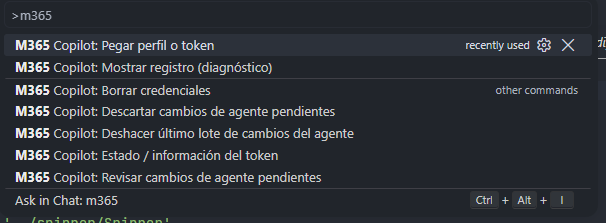

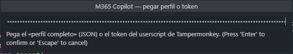

## 5. Show the models in the chat

The most direct way is to type **`@m365`** in the chat: M365 Copilot always
answers, without touching the model picker.

If you prefer to use it as a model (for example in agent mode), you have to show
it in the picker, because it does not appear at first:

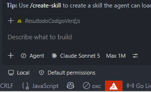

In the model picker, click the gear and then **Other models**:

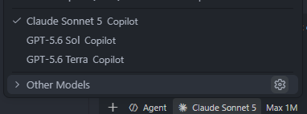

Scroll down to see the M365 Copilot options:

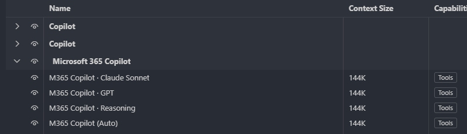

You can pin them; otherwise they appear at the end of the model picker.

## 6. Start using it

You can ask a coding question:

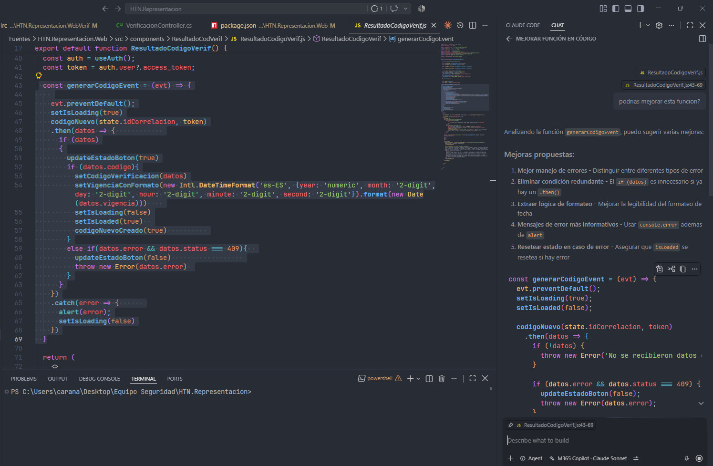

Or ask for a code edit: each changed block appears highlighted in the editor
with its own **Keep / Undo** above it (and the whole-file actions, with ↑ / ↓ to
jump between changes, in the editor title bar) so you can accept or revert it
block by block.

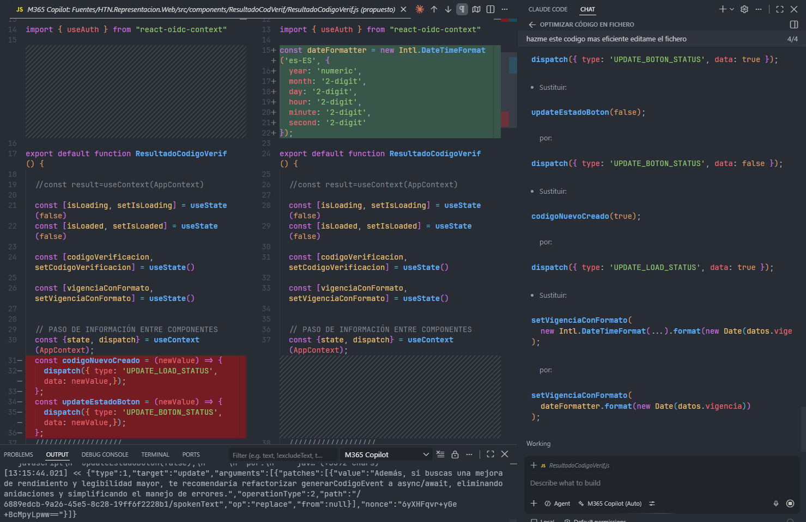

From the editor itself:

- **`Ctrl + Shift + Alt + I`** with code selected (or the cursor inside a
  function): type an instruction ("add error handling") and the change is
  applied right there, with Keep / Undo.
- **Right-click → M365 Copilot**: edit, explain, ask about, review, fix, document
  or generate tests for the selected code (or the function the cursor is in).
  **Review code** leaves its findings as comments on the lines, each with
  **Apply fix** and **Dismiss** (they are also in the **Comments** panel).
- **Lightbulb (`Ctrl + .`)** on an error: **Fix with M365 Copilot**, which fixes
  it in place — and **Fix all problems in this file** when there are several.
- **Source Control**: the ✨ button in the title bar writes the commit message
  with M365 Copilot, and ☑ reviews your uncommitted changes as comments.
- **Auto-commit** (quick menu → *Turn on auto-commit*, or the `…` menu of Source
  Control): while you work, M365 Copilot commits your changes when they make a
  finished unit — with a message that explains what and why — and waits while
  they are in progress. It never pushes; every auto-commit has **Undo**.
- **Accounts menu** (person icon, bottom left): shows your M365 Copilot account,
  signs you out (deletes the token), and signs you in when there is no token.
- **Sign out and sign in again** (quick menu, or the command palette): when you
  want to sign in with another account, or renewal goes wrong, this also
  deletes the **browser's Microsoft session** - cookies and MSAL's cache - and
  asks for your credentials again. It is the only thing that does: asking for
  another token reuses the same old session, which hands one out without asking
  anything. It needs the browser extension (the userscript cannot delete
  cookies).

M365 Copilot also **knows your project**: a local index of the workspace adds
the relevant code to each request, and **M365 Copilot: Search the project…**
finds code by meaning ("where is the token saved"). With the browser extension
or the userscript, it can also **search the internet** when it needs to.
- **Terminal**: when a command fails, right-click in the terminal → **Explain
  last terminal command**.

## 7. Language

By default the extension follows VS Code's language (English or Spanish). To
change it: status bar menu → **Language**, or the `m365copilot.language`
setting. It also changes the language of the instructions sent to the model, so
it answers in that language.

---

It works well for exploring files and folders, answering questions and editing
code — quite good for a wrapper around a model that was not built to work as an
agent or an MCP client.
